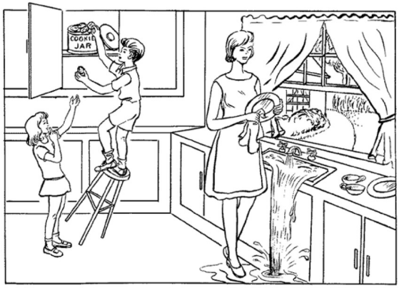

In this challenge, we provide the latest corpus to the community to focus on early-stage dementia detection. The corpus is highly relevant for advancing dementia detection research and, as such, continues the impact trajectory of the previous challenges led by Luz and his team. The PROCESS data has the following advantages:

* This corpus provides a wider variety of diagnostic classes for different subtypes of early-stage dementia, including mild cognitive impairment (MCI). This aligns with actual clinical diagnoses, allowing early-stage dementia detection and making the research questions closer to real-world applications.
* The healthy control (HCs) group is composed of volunteers with no known cognitive issues impairments as well as groups who may have other memory problems not caused by neurodegenerative disease. This aligns with the real-world scenario where, clinically, the early identification of people showing early signs of being at risk of developing dementia would versus people who may need treatment for other causes of e.g. memory problems, is useful.
* The corpus provides diagnostic class labels in addition to cognitive assessment scores. Because of the varied nature of the data, a number of different scores are provided including the Montreal Cognitive Assessment (MoCA), Mini-Cognitive Examination (MCE), and Alzheimer’s Cognitive-III (ACE-III) for the different data (reflecting variations in clinical standard practice in e.g., dementia and stroke pathways). We will also provide a unified Mini-Mental State Exam (MMSE) score for some speakers, which is converted from the MoCA, MCE or ACE-III scores. This converted score will form the basis of the prediction challenge; the diagnostic class labels will support the classification task.

#### Prompts
The method for corpus collection was designed based on neuroscience research for dementia diagnosis. It includes the audio from three types of elicitation tasks: the Semantic Fluency, the Phonemic Fluency, and the Cookie Theft picture description task.

* **Semantic Fluency** asks participants to respond to the task of “Please name as many animals as you can in a minute.” This is similar to the naming task in many cognition assessments, which primarily evaluate language abilities and naming skills to detect potential issues in language comprehension and expression.
* **Phonemic Fluency** asks participants to respond to the task of “Please say as many words beginning with the letter ‘P’ as you can. Any word beginning with ‘P’ except for names of people such as Peter, or countries such as Portugal.” The time limit for this is also a minute and this task is similar to the language tasks used in cognition assessments to test verbal fluency and executive functions related to language.
* **Cookie Theft** picture description. Figure 1 shows the picture of Cookie Theft which speakers are asked to describe. This approach is widely used to collect audio in dementia detection research. This type of audio is expected to reflect various cognitive functions of speakers, such as language comprehension and memory.

**Fig. 1.** Cookie Theft picture from the Boston Diagnostic Aphasia Examination.

#### The Corpus
The training and development sets consist of audio recordings and corresponding manual transcripts of each prompt for every speaker. For the classification task, we provide a diagnosis for each speaker (such as healthy volunteer, MCI and dementia), while for the regression task, we provide the MMSE score for each speaker.

**Important**: for the test set, the transcripts and diagnoses are not available because providing manual transcription conflicts with the design principles of modern automated detection systems.

#### Results on the test set

{ width=50% }